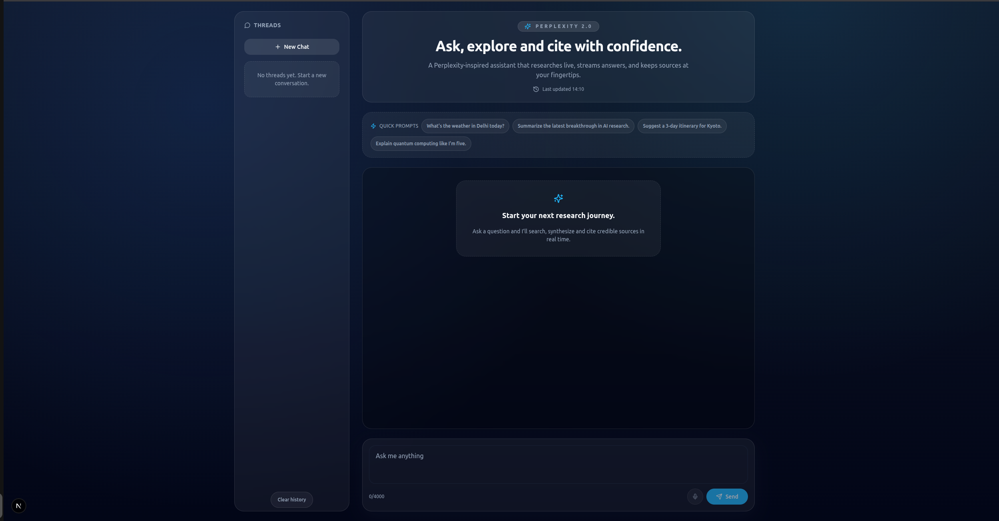

# Perplexity 2.0 – Retrieval-Augmented Streaming Agent

Perplexity 2.0 is a full-stack research assistant that pairs a LangGraph-powered reasoning agent with a Perplexity-style streaming UI. The backend wires Groq’s Qwen3-32B model into an autonomous LangGraph workflow with tool routing, search augmentation (Tavily), and checkpointed dialogue state. The frontend (Next.js + Zustand) consumes the backend’s server-sent events (SSE) to render streaming markdown, live search status, and citation chips.

> 🎯 Goal: showcase production-friendly AI engineering skills – orchestration, tool calling, streaming transport, and UX that stays in lockstep with the backend.



🎞️ **Preview :** [`docs/demo.gif`](docs/demo.gif)

---

## 🧠 System Overview

```
┌────────────┐      Human Prompt      ┌─────────────────────────┐
│  Next.js   │  ───────────────────▶  │ FastAPI / LangGraph API │
│  App       │◀────────────────────── │  /chat_stream endpoint  │
└────────────┘   Streaming SSE        └──────────┬──────────────┘
       │                                        │
       │                            LangGraph StateGraph (memory)
       │                                        │
       │                               ┌────────▼────────┐
       │                               │   ChatGroq LLM  │
       │                               │ (Qwen3-32B)     │
       │                               └────────┬────────┘
       │                                        │ tool call
       │                               ┌────────▼────────┐
       │                               │ Tavily Search   │
       │                               └─────────────────┘
```

### Conversation Flow
1. **Thread selection** (client) decides whether to continue with an existing `checkpoint_id`.
2. **`/chat_stream/{message}`** (server) starts a LangGraph run. A new thread generates a UUID checkpoint and stores it with LangGraph’s `MemorySaver`.
3. **LangGraph graph**
   - `model` node calls Groq’s streaming Qwen model (tool-enabled).
   - `tools_router` routes to `tool_node` when the LLM requests Tavily search.
   - Tool responses are added back into the message state.
4. **Streaming contract** emits discrete SSE events:
   - `checkpoint` ⇒ thread continuity.
   - `content` ⇒ token-chunk text (escaped for JSON safety).
   - `search_start` ⇒ announces the Tavily query.
   - `search_results` ⇒ curated URL list.
   - `end` ⇒ run complete, UI unlocks input.
5. **Client store** appends content, updates search status, and persists the thread locally.

This architecture gives you tool-aware reasoning, search refinement, and a fluid UX without polling.

---

## 🧰 Backend (FastAPI + LangGraph)

### Key Components (see [`server/code.py`](server/code.py))
- `StateGraph` with nodes:
  - `model` – Groq Qwen3-32B with `streaming=True`.
  - `tool_node` – executes Tavily Search results.
  - `tools_router` – sends control flow to the tool node only when tool calls exist.
- `MemorySaver` – persists LangGraph checkpoints keyed by `thread_id`.
- `generate_chat_responses()` – async generator that transforms LangGraph events into SSE frames.
- `serialise_ai_message_chunk()` – normalises LangChain message chunks to plain text.
- `FastAPI` endpoint `/chat_stream/{message}` – wraps the generator in a `StreamingResponse` with `text/event-stream` media type.

### Environment Variables
Create a `.env` file (or export variables) before running the backend:

```env
GROQ_API_KEY=...
TAVILY_API_KEY=...
```

Both are loaded automatically via `dotenv.load_dotenv()`.

### Install & Run

```bash
# from the repo root
pip install -r requirements.txt

# start the SSE API (auto-reload for local dev)
cd server
uvicorn code:app --reload
```

The API listens on `http://127.0.0.1:8000` by default. Adjust `uvicorn` flags if you need a different host/port.

### Notable Implementation Details
- **Event sanitisation**: Streams escape quotes/newlines to keep JSON parsing safe on the client side.
- **Tool feedback loop**: Tool output is wrapped as LangChain `ToolMessage`, closing the loop for the next LLM step.
- **Search UX hooks**: `search_start` is emitted immediately after the LLM issues a Tavily tool call; `search_results` emit only when Tavily returns structured URLs.
- **Checkpoint strategy**: the initial response sends `checkpoint` before any content so the UI can persist immediately, even if the model keeps streaming for a long time.

---

## 💻 Frontend (Next.js App Router)

Although the focus is backend-centric, the UI demonstrates how to operationalise the SSE stream:

- `lib/sse.ts` – robust EventSource helper with `[DONE]` handling and tolerant logging for keep-alives.
- `store/chat.ts` – Zustand store managing threads, checkpoints, and SSE lifecycle.
- `app/page.tsx` – orchestrates streaming UI, quick prompts, and sources drawer.

### Frontend Setup

```bash
cd client/my-app
npm install
cp .env.example .env.local   # adjust NEXT_PUBLIC_API_BASE_URL if needed
npm run dev
```

Open `http://localhost:3000` and start a conversation. Press `Esc` to stop the current stream; use “Clear history” to drop saved checkpoints.

---

## ✅ Testing the Full Loop

1. **Bootstrap environment**
   ```bash
   # backend
   pip install -r requirements.txt
   uvicorn server.code:app --reload

   # frontend
   cd client/my-app
   npm install
   npm run dev
   ```
2. **Visit** `http://localhost:3000` and submit a query such as “Summarise the latest breakthrough in AI research.”
3. **Observe** the timeline:
   - Live streaming chunks appear in the chat bubble.
   - “Searching …” indicator shows the Tavily query.
   - Citation chips render as soon as URLs arrive; open the sources panel to inspect deduplicated links.
   - Follow-up questions reuse the saved checkpoint; stopping or clearing threads resets the state.

---

## 🐳 Containerisation & Deployment

### Local Docker workflow

```bash
# build from the repo root so requirements.txt is in the Docker context
docker build -f server/Dockerfile -t perplexity:latest .

# run the API container (exposes the SSE endpoint on localhost:8000)
docker run -d \
  -p 8000:8000 \
  -e GROQ_API_KEY="<your_groq_key>" \
  -e TAVILY_API_KEY="<your_tavily_key>" \
  --name perplexity-container \
  perplexity:latest

# tail logs if you want to monitor streaming traffic
docker logs -f perplexity-container
```

Point the frontend at the container by setting `NEXT_PUBLIC_API_BASE_URL=http://localhost:8000` in `client/my-app/.env.local` before running `npm run dev`.

### Render deployment notes

The project is tested on Render using the same `server/Dockerfile`.

1. Create a new **Web Service** in Render and select “Deploy from GitHub”.
2. Pick this repo and, when prompted, keep “Docker” as the runtime (`server/Dockerfile` is detected automatically).
3. Set the **Start Command** to rely on the image default (or explicitly: `uvicorn code:app --host 0.0.0.0 --port ${PORT:-8000}`).
4. Add required environment variables: `GROQ_API_KEY`, `TAVILY_API_KEY`, and optionally `PIP_DEFAULT_TIMEOUT=120` to smooth out large dependency downloads during build.
5. After the backend deploys, configure the frontend with `NEXT_PUBLIC_API_BASE_URL=https://<render-app>.onrender.com` so the UI calls the hosted API.

Render performs health probes against the root path; the FastAPI app responds 404 by design, but `/docs` and `/openapi.json` return 200, confirming the service is healthy. Avoid committing `.env.local` or other files that contain secrets—Render manages API keys via its dashboard.

---
